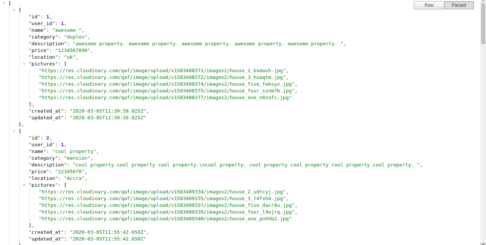

## Introduction
This is a public Api, built to serve as a backend for the real estate project. A project that student have to do as the last project in the main Microverse curriculum, based on the concept of software as a service.



## App description
The app allows authenticated users to access information about properties they seek to sell online and also allow users to make contact with estate agent to purchase a property.
This is the backend component which is expected to run on a react front end api.
The backend has different routes needed by the front end to accepts specific resources. The authentication is managed with Jwt.

## Base url

#### https://myestateapi.herokuapp.com/

Responds with JSON response

## Usage

> Clone the repository to your local machine

```sh
$ git clone https://github.com/forison/Real-estate-api.git
```
> cd into the directory

```sh
$ cd Real-estae-api
```

```sh
$ rails s
```
## Testing

> Clone the repository to your local machine

```sh
$ git clone https://github.com/forison/Real-estate-api.git
```
> cd into the directory

```sh
$ cd Real-estate-api
```

```sh
$ rspec
```
## Technologies

- Ruby on rails
- RSpec

## Author

👤 **Addo Forison**

## Contact

[LinkedIn](https://www.linkedin.com/in/forison/) | [Twitter](https://twitter.com/addo_forison)

> This app is still under construction and not every feature has been fully implemented.
No test has been done yet.
This is only being submitted so I can move on to other tasks since the application meets the basic requirement requirement.
